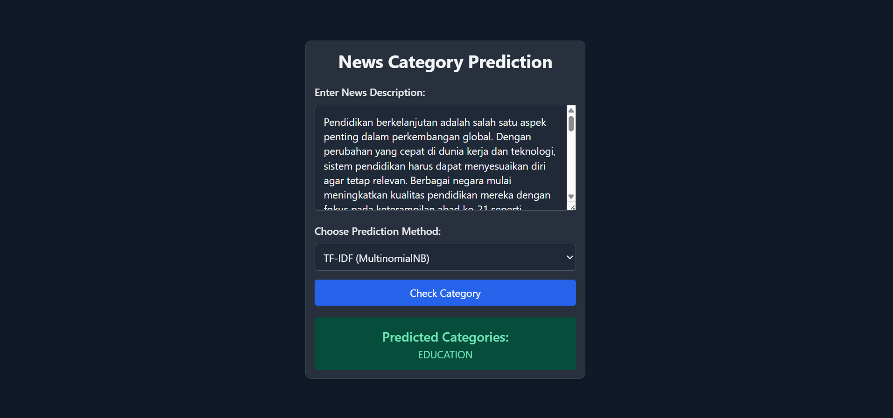

# 📰 News Category Classifier Web App

Aplikasi ini merupakan sistem klasifikasi berita berbasis web yang mampu memprediksi kategori berita menggunakan dua pendekatan:

1. **Model Machine Learning klasik (Multinomial Naive Bayes + TF-IDF)**
2. **Large Language Model (LLM) Gemini dari Google**

---

## 🔍 Fitur Utama

- Input teks berita dari user
- Deteksi dan terjemahan otomatis jika teks menggunakan Bahasa Indonesia
- Preprocessing teks (cleaning, stopwords, stemming, dll)
- Klasifikasi berita ke dalam 5 kategori:
  - **BUSINESS**
  - **EDUCATION**
  - **ENTERTAINMENT**
  - **SPORTS**
  - **TECHNOLOGY**
- Dua mode klasifikasi:
  - **TF-IDF + Naive Bayes**
  - **Gemini LLM** untuk klasifikasi generatif

---

## 🛠️ Tech Stack

- [Python](https://www.python.org/)
- [Flask](https://flask.palletsprojects.com/)
- [Scikit-learn](https://scikit-learn.org/)
- [NLTK (Natural Language Toolkit)](https://www.nltk.org/)
- [Langdetect](https://pypi.org/project/langdetect/)
- [Deep Translator (GoogleTranslator)](https://pypi.org/project/deep-translator/)
- [Gemini API (Google Generative AI)](https://ai.google.dev/)
- [Joblib](https://joblib.readthedocs.io/)
- [HTML + Jinja2](https://jinja.palletsprojects.com/)

---

## 🧠 Model & Dataset

- Dataset terdiri dari lima kategori berita: `business`, `education`, `entertainment`, `sports`, dan `technology`
- Preprocessing teks termasuk:
  - Menghapus HTML, URL, angka, tanda baca
  - Menghapus stopwords dan melakukan stemming
- Model: **Multinomial Naive Bayes**
- Representasi teks: **TF-IDF Vectorizer**
